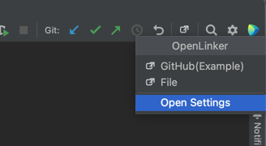
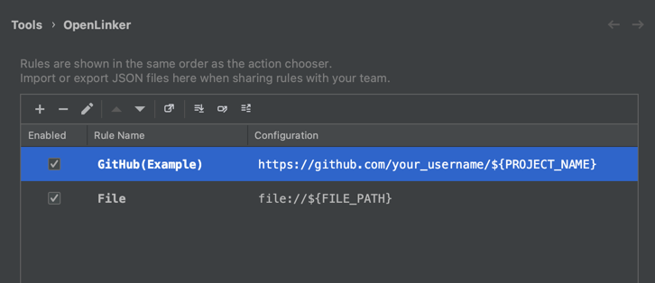

# OpenLinker

中文: [README_zh.md](README_zh.md)

OpenLinker is a JetBrains IDE plugin that opens context-aware web or file links from customizable URL templates.

### What it does

- Opens links from the top toolbar icon and `Tools > OpenLinker` 
- Builds URLs from customizable rules with placeholders (for project, module, and file context)
- Handles both **web links** and `file://` paths (revealed in your system file manager)
- Lets you manage, persist, import, and export rules from `Settings > Tools > OpenLinker`

### Installation

This repository is currently set up as a source project. To try the plugin:

1. Open the project in IntelliJ IDEA
2. Run `./gradlew runIde`
3. In the sandbox IDE, use OpenLinker directly

### Quick Start

1. Open `Settings > Tools > OpenLinker`
2. Add, edit, import, or export rules
3. Click `Tools > OpenLinker` (or use the top toolbar icon)

### Screenshots

Toolbar popup:



Settings page (rules):



### Import and Export

- Export is available in the settings page toolbar; you can export all rules or only the selected rule
- Import is also in the settings page toolbar; imported rules are appended to the end of the current list
- Imported changes are like normal edits: click `Apply` or `OK` to persist them
- Import/export files use JSON with this structure:

```json
{
  "version": 1,
  "rules": [
    {
      "name": "GitHub(Example)",
      "urlTemplate": "https://github.com/your_username/${PROJECT_NAME}",
      "enabled": false
    }
  ]
}
```

### Variable Reference

- `PROJECT_NAME`: current project name
- `MODULE_NAME`: current module name; empty if unavailable
- `FILE_NAME`: current file name; empty if unavailable
- `FILE_PATH`: full path of the current file; empty if unavailable

### Requirements

- Java 17
- IntelliJ IDEA 2023.1 or later

### Run Locally

1. Open the project in IntelliJ IDEA.
2. Make sure Gradle JVM is Java 17.
3. Run the `runIde` task to start a sandbox IDE.

If you prefer the command line:

```bash
./gradlew runIde
```

### Tests

The project includes basic tests covering these core cases:

- Whether default rules exist
- Rule load results after persistence
- JSON format and validation for rule import/export
- URL template variable substitution
- Decision branches for 0 / 1 / multiple enabled rules

Run:

```bash
./gradlew test
```
